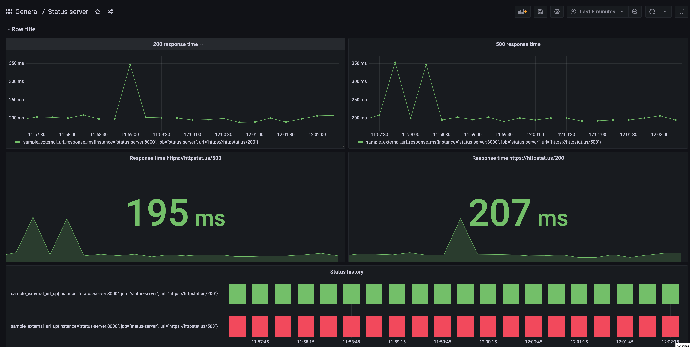
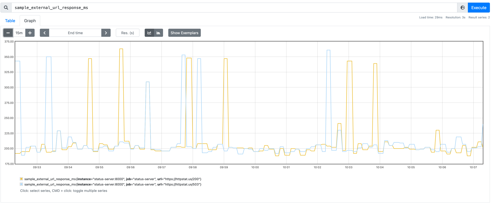
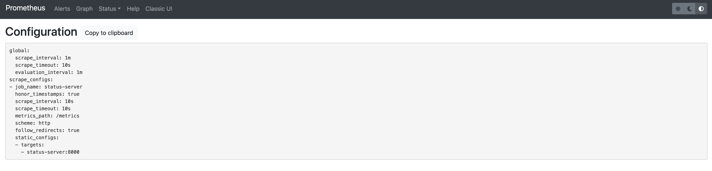

# Status-server
Monitor endpoints and expose Prometheus metrics.
For now it only supports checking 2 endpoints:

* https://httpstat.us/503
* https://httpstat.us/200 

Prometheus endpoint is exposed in `/metrics`. Exposed metrics are:

* `sample_external_url_up`
* ` sample_external_url_response_ms`

By default `status-server` add one label to each metric:
* `url`

## Building 

In order to build `status-server` execute:

```sh
$ make build
```

The outcome binary can be found as `_output/status-server`

## Building docker

In order to build docker image run:

```sh
$ make build-docker
```

Default value of the image is `status-sever:latest`. It can be modified be setting environment variable `IMAGE`, e.g:

```sh
$ IMAGE=docker.io/my-repo/status-server:v0.0.1 make build-docker
```

## Running

`status-server` accepts two command lines arguments:

* `-interval` - which accepts a duration between consecutive checks. It accepts string which will be parsed as GO's `time.Duration`, e.g. `100ms` or `10s`. Valid time units are "ns", "us" (or "µs"), "ms", "s", "m", "h". Defaults to `1s`.
* `-port` - TCP port that the server will accept requests. By default `8000`.

So to run `status-server` that listens on port `7000` and check urls every `10s` run:

```sh
$ _output/status-server -interval 10s -port 7000
```

or as docker container:

```sh
$ docker run -it -p 7000:7000 -_name status-server status-server -port 7000 -interval 10s
```

And to validate it is working run:

```sh
$ curl localhost:7000/metrics
```

It should return such response:

```
# HELP sample_external_url_response_ms Response time in ms
# TYPE sample_external_url_response_ms gauge
sample_external_url_response_ms{url="https://httpstat.us/200"} 384
sample_external_url_response_ms{url="https://httpstat.us/503"} 396
# HELP sample_external_url_up Whether service is up or down
# TYPE sample_external_url_up gauge
sample_external_url_up{url="https://httpstat.us/200"} 1
sample_external_url_up{url="https://httpstat.us/503"} 0
```

## Testing

To run unit tests execute:

```sh
make tests
```

## Deploying to Kubernetes

In `kubernetes` directory, one can find `kustomization` file and deployment manifest to deploy `status-server` to Kubernetes.
Before deploying make sure the `images` section of `kustomization.yaml` file is edited to point to docker registry where `status-server` image is present.
To deploy in other namespace than `default` change `namespace` section of `kustomization.yaml` file.
To install `status-server` to Kubernetes, execute:

```
kubectl apply -f kubernetes
```

## Testing locally Prometheus integration

I have prepared scripts to deploy `Grafana`, `Prometheus` and `status-server` locally, to be able to test integration between `status-server` and `Prometheus`.

The script `hack/setup_stack.sh` is building `status-server` docker image, creating docker network and running `Prometheus`, `Grafana` and `status-server` as docker containers in this network. To deploy it execute:

```sh
$ hack/setup_stack.sh
```

Accessing services:

* `localhost:3000` - Grafana, logging in requires to type username `admin` and password `admin`, Grafana is already configured to connect to Prometheus and has one default dashboard called `Status server`
* `localhost:9090` - Prometheus UI, which is already configured to scrape `status-server` every `10s`

Grafana Dashboard:


Prometheus Graph:


Prometheus Config:



To clean up run `hack/teardown_stack.sh` script which will remove all docker containers and docker network.
